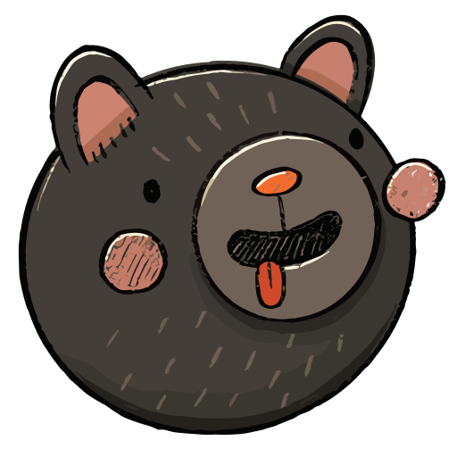

# 🏙️ Introduction 

Hello 👋, I'm Chethaka. I'm a passionate software developer focused on innovative user friendly solutions for various problems using technologies like React Native, NextJS, Flask and Docker 🐳. 

🛐 My areas of interest: 
  * Web application development 
  * Back-end development
  * Mobile app development
  * Network programming

Driven by a curiosity for learning and a desire to grow, I'm constantly exploring new technologies and improving my skills to build better, more efficient solutions. Whether it's optimizing existing projects or diving into new challenges, my goal is to make a meaningful impact through technology 🚀

<!-- # 🛠️ Tech stack      

  
  
  
  
  
  

# 🏹 Tools in my armory 

  
  
  
  
  
  
  
  
  

 -->

# 🛠️ Tech stack      

  
  
  
  
  
  

# 🏹 Tools in my armory 

  
  
  
  
  
  
  
  
  

